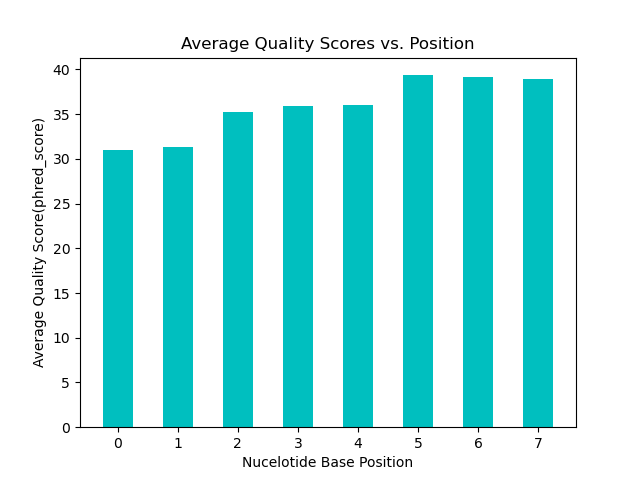
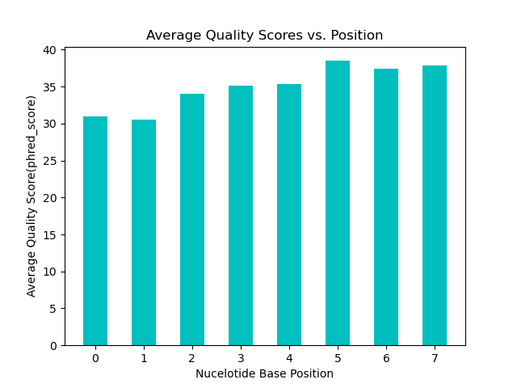
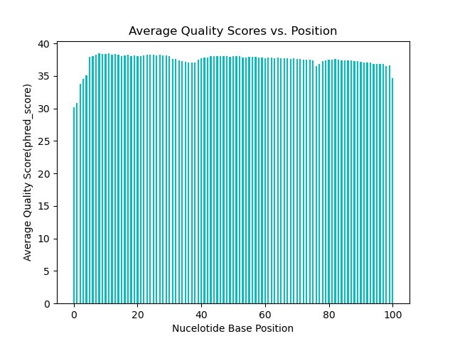

# Assignment the First
Kenneth Lai 
## Part 1
1. Be sure to upload your Python script. Provide a link to it here:
```https://github.com/klai22/Demultiplex/blob/master/Assignment-the-first/part1.py```

| File name | label | Read length | Phred encoding |
|---|---|---|---|
| 1294_S1_L008_R1_001.fastq.gz | read1 | 101 | phred+33 |
| 1294_S1_L008_R2_001.fastq.gz | index1 | 8 | phred+33 |
| 1294_S1_L008_R3_001.fastq.gz | index2 | 8 | phred+33 |
| 1294_S1_L008_R4_001.fastq.gz | read2 | 101 | phred+33 |

2. Per-base NT distribution
    1. Use markdown to insert your 4 histograms here.
    
|Index 1 (R2)| Index 2 (R3) |
|---|---|
| ||

|Read1 (R1)| Read2 (R4)|
|---|---|
| ||


2. What is a good quality score cutoff for index reads and biological read pairs to utilize for sample identification and downstream analysis, respectively? Justify your answer.

    A good quality score cutoff for index reads is >= 30. In cases where index sequencing performed poorly, I wouldn't suggest decreasing the threshold any lower than 26 as it may result in false sample assignment. Previous research by [Wright et al.](https://www.ncbi.nlm.nih.gov/pmc/articles/PMC5097354/#:~:text=By%20filtering%20the%20index%20reads,maintaining%2088%20%25%20of%20total%20reads.) suggested filtering index reads by >= 26 to reduce 'sample cross-talk'. [Illumina](https://www.illumina.com/science/technology/next-generation-sequencing/plan-experiments/quality-scores.html#:~:text=Illumina%20Sequencing%20Quality%20Scores,sequencing%20applications%2C%20including%20clinical%20research.) on the other hand states that a quality score of at least 30 is ideal for clinical research and other sequencing-based applications. Personally, I would choose 30 for this assignment since the lowest average quality scores observed in our quality-score distributions fell around ~31. 

    On the other hand, I would sugggest setting a quality score threshold of ~26 for biological read pairs. However, the threshold for these reads don't need to be as strict as the indexes because the following step in this pipeline (genomic alignment) will filter out poor reads anyways. 

3. VERSION 2: Counting the NUMBER OF EVERY BARCODES w/ N in them (DOES-double-count duplicates of same barcodes w/ N in them)
* Index 1: 
```
$ zcat /projects/bgmp/shared/2017_sequencing/1294_S1_L008_R2_001.fastq.gz | sed -n '2~4p' | grep -c 'N'
3976613
```
* Index 2: 
```
$ zcat /projects/bgmp/shared/2017_sequencing/1294_S1_L008_R3_001.fastq.gz | sed -n '2~4p' | grep -c 'N'
3328051
```

    
## Part 2
1. Define the problem
*  Input of 4 .fq files (R1 [read1],R2[index1],R3[index2],R4[read2]) and a list of 24 known indexes. 
* The overall goal is to sort reads according to the sample they originated from (as indicated by index pairs). This is known as demultiplexing. 
* We need to sort each of our reads into different types of files, holding.. 
    * Reads of every known index pair. 
    * Reads w/ unknown index-pairs
    * Reads w/ mismatched index pairs, indicative of index hopping events
* This way, each of our output files will hold all the reads detected which belong to a given sample (defined by index pairs)

2. Describe output
* 52 total files: 
    * 2 files (R1 & R4 records) x 24 known possible indexes =  48 files 
    
            [index-pair_R1.fq & index-pair_R2.fq]
    * File of reads w/ unknown index-pairs = 2 files 
    
            [UNK_R1.fq & UNK_R2.fq]
    * File for reads w/ mismatched index pairs (index hopping) = 2 files 
    
            [Hopped_R1.fq & Hopped_R2.fq]

3. Upload your [4 input FASTQ files](../TEST-input_FASTQ) and your [>=6 expected output FASTQ files](../TEST-output_FASTQ).
```
Input: /home/kenlai/bgmp/bioinfo/Bi622/Assignments/Demultiplex/TEST-input_FASTQ

Output: /home/kenlai/bgmp/bioinfo/Bi622/Assignments/Demultiplex/TEST-output_FASTQ
```
4. Pseudocode (for a python script)
```
#Opening Input Files 
[with open] input .fq files: R1 & R4 (reads), R2 & R3 (indexes),known_barcodes.txt(lists known barcodes):
    #Looping through R3 barcodes & collecting associated R2 barcodes (same ID)
    [For] every seq.line in R3:
        R3C_variable = reverse_complement(R3 seq.)
        R2_variable = isolated seq. from same read as current R3C _variable (taken from R2) 
    #Creating new versions of R1/R4 with IDs that include 'R2-R3 barcodes' in name
        R1_new = index_seq_to_header(R1,R3C_variable,R2_variable)
        R4_new = index_seq_to_header(R4,R3C_variable,R2_variable)
    #Looping through every record of updated R1/R4 & checking for matches in known_barcodes.txt
    #REPEAT ALL STEPS BELOW FOR R4 AS WELL! 
    [For] every record in R1_new:
        #Set record equal to a variable 
            record = current record
        #isolate R2 & R3 barcodes from ID --> check to see if they have matches in known_barcodes.txt
        False --> write_record_to_file(record,UNK_R1.fq)
        True -->:
            #Is R2 barcode == R3 barcode?:
                False --> write_record_to_file(record,Hopping_R1.fq) #indicative of index hopping
                True --> (barcodes are complementary):
                    #Isolate QS line associated w/ current header/ID
                #Calc. avg/median QS for current record 
                    qs = calc_qs()
                    #Test if current record's QS meets threshold 
                        Falls below threshold --> write_record_to_file(record,UNK_R1.fq)
                    #printing record in appropriate index-pair file
                        Meets QS threshold --> write_record_to_file(record,{R2}-{R3}_R1.fq)
```

5. High level functions. For each function, be sure to include:
    1. Description/doc string
    2. Function headers (name and parameters)
    3. Test examples for individual functions
    4. Return statement
```
def reverse_complement(sequence: str) -> str:
    '''takes a DNA seq. & generates its complementary sequence, utilizes a dictionary including correct base pairings'''
    return reverse_complement_sequence
Input: DNA str (template seq.)
Expected output: DNA str (complementary seq.)

assert reverse_complement("GGG") == "CCC", "wrong reverse_complement for seq.'GGG'"
print("Your reverse_complement function is working! Nice job")
```
```
def index_seq_to_header():
    '''Created new version of R1 or R4 w/ 'R2-R3' in the ID/headers of each record'''
    return reverse_complement_sequence
Input:R1 OR R4,R2_variable, R3C_variable
Expected output: R1_new OR R4_new
```

```
def calc_qs(letter: str) --> int:
    '''Converts every letter in qs_line to a score, calc.s either the average or median (TBD) of a collection of quality scores'''
    #Will have to call bioinfo.convert_phred()
    return qs_mean 
Input:list of quality scores per position of read 
Expected output: qs_mean, a number 

#assuming mean quality scores are being compared to threshold...
assert reverse_complement("@A=") == "30.33", "wrong qs_score calculated for seq.'@A='"
print("Your calc_qs function is working! Nice job")
```

```
def write_record_to_file():
    '''appends currently stored record to a specified file (doesn't overwrite)'''
    return 
Input:record (currently store variable), output file of interest
Expected output: nothing, but alters specified file 
```