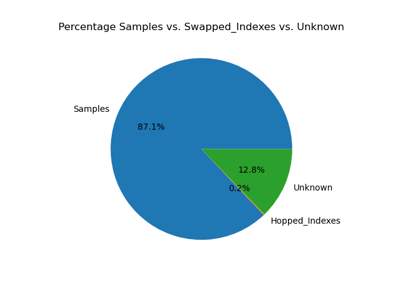
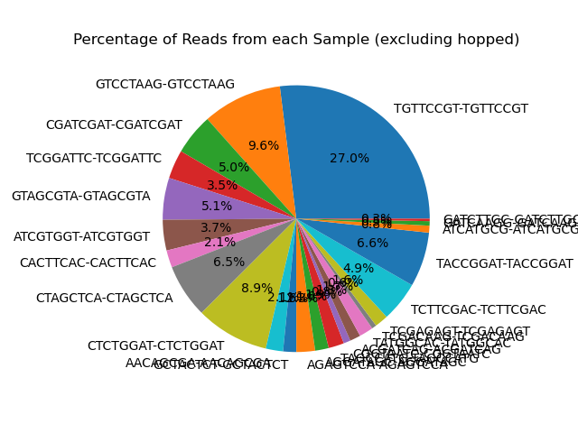
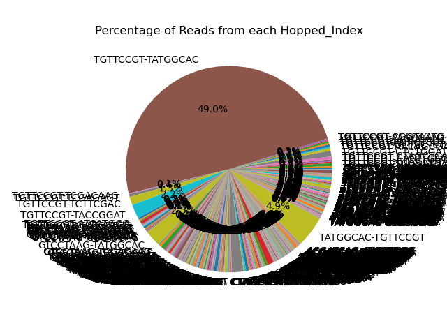
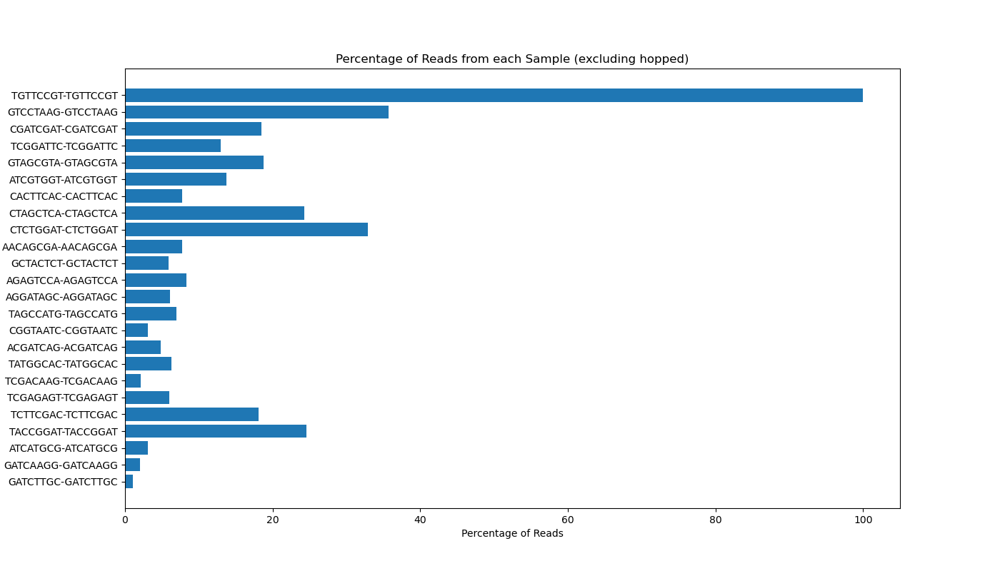
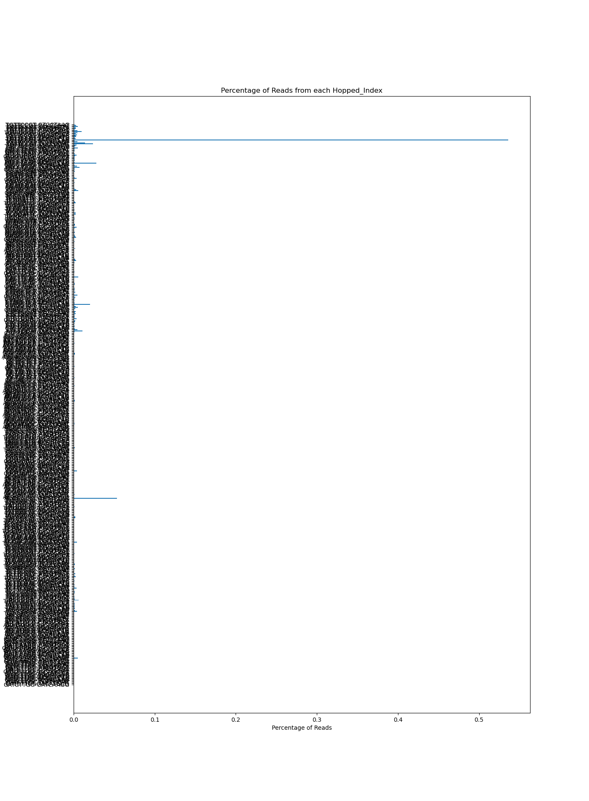

# Demultiplexing and Index Swapping - Assignment the Third
Kenneth Lai 

### Assignment: Write your code to demultiplex the samples. Be sure to:

- Incorporate feedback from peer code reviews
- Utilize appropriate functions (perhaps you want to `import bioinfo`???)
- Sufficiently comment your code/use docstrings/use type annotations on functions
- Use unit tests on functions/entire algorithm to ensure it works properly
- Create a useful report for the end user of your code
- Use `argparse` to "generalize" your code
- Be mindful of "simple" things you can do to optimize your code
- Follow the specifications laid out in [Assignment the First](../Assignment-the-first#part-2--develop-an-algorithm-to-de-multiplex-the-samples) for the code
    - Unclear? Ask!

Modules that are fair game to import:
- bioinfo
- argparse
- math
- gzip
- numpy
- matplotlib
- itertools

Final work will be submitted on [GitHub in the Assignment-the-Third folder](.). Make sure your folder is well organized and final output is clearly labeled/summarized (a markdown file would be much appreciated!!). Use your code to demultiplex the samples and report:
- Percentage of reads from each sample
- Overall amount of index swapping
- Any figures/any other relevant data your code output


# REPORT 
1. Python Scripts/Outputs:
* Table including read counts for every detected barcode (post demultiplexing):```https://github.com/klai22/Demultiplex/blob/master/Assignment-the-third/Barcode_Pair_Counts.txt``` 
* demultiplexing samples & creating barcode count table : 
```https://github.com/klai22/Demultiplex/blob/master/Assignment-the-third/demultiplex.py```
* Analyzing barcode count table: 
```https://github.com/klai22/Demultiplex/blob/master/Assignment-the-third/demux_stats.py```

2. Report on Demultiplexing Results 

### Reads Distribution per Sample
|Overall Distribution|
|---|
||
|distribution of all reads based on barcode pairings. Demultiplexing filtering thresholds: hamming distance = 3, index 1 qs = 29, index 2 qs = 26. |

- Overall amount of index swapping = 0.2% of total reads 

|Sample Distribution| Swapped Index Distribution|
|---|---|
|||
||refer to Figure at bottom of report, figure was quite long, very hard to read, pie chart is better in my opinion|
|distribution of reads w/ matching indexes|distribution of reads w/ unmatched indexes|

- Percentage of reads from each sample = Sample Distribution Fig.

- Majority (49%) of hopped reads fell under the swapped barcode 'TGTTCCGT-TATGGCAC'


